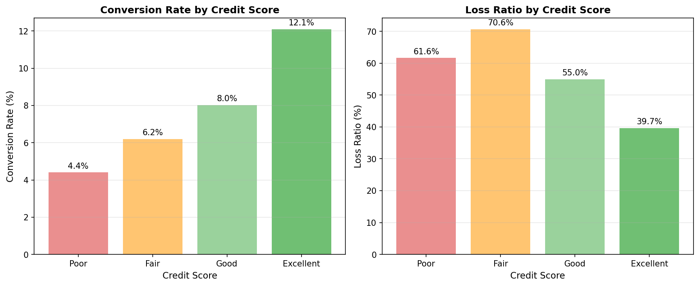
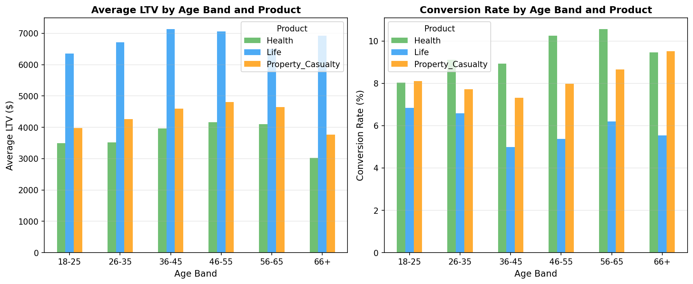
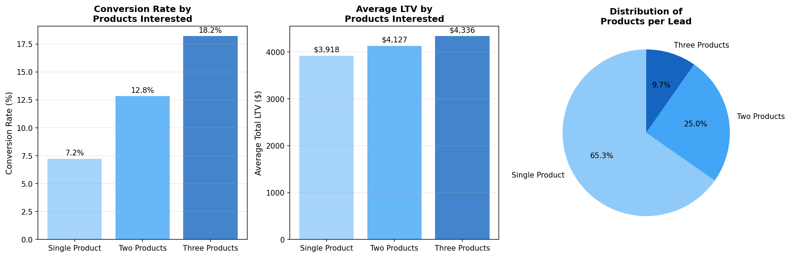
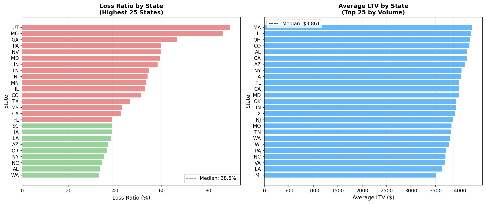
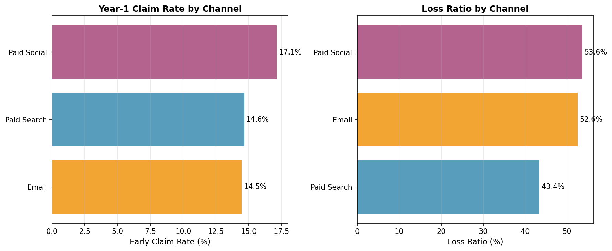
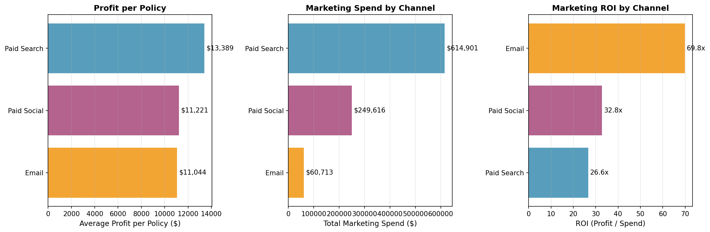
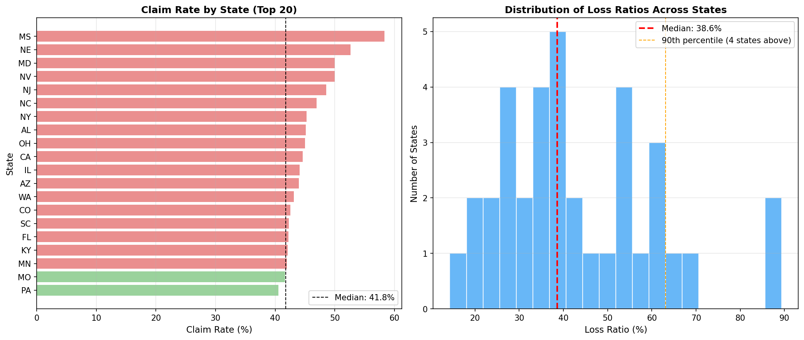
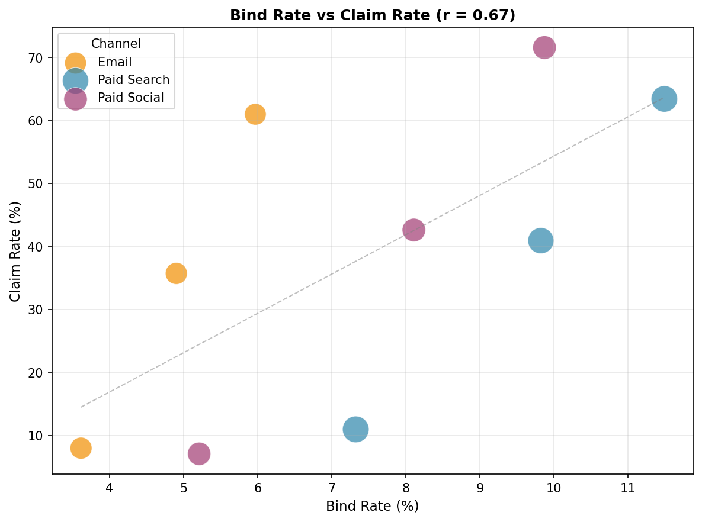

---
---

 # Exploratory Data Analysis

[← Back to Home](../../index.md)

---

This page presents eight exploratory analyses that reveal the key dynamics of insurance marketing. Each analysis surfaces insights that inform the marketing mix model and budget optimization.

---

## 1. Credit Score Impact on Conversion and Loss Ratio

<table>
<tr>
<td width="50%" valign="top">

Credit-based insurance scores are a major underwriting tool. This analysis validates that better credit correlates with **both** higher conversion rates AND lower claims.

**Key Finding:** Excellent credit customers convert at 3x the rate of Poor credit, with loss ratios 20 percentage points lower.

**Implication:** Credit score should inform lead prioritization, not just pricing.

</td>
<td width="50%" valign="top">

</td>
</tr>
</table>

---

## 2. Optimal Age Bands by Product

<table>
<tr>
<td width="50%" valign="top">

Age is the primary rating variable in life and health insurance. The optimal customer age differs by product line.

**Key Finding:** 
- Life insurance LTV peaks at ages 36-45
- Health and P&C show different age patterns
- Targeting should be product-specific

**Implication:** One-size-fits-all age targeting leaves value on the table.

</td>
<td width="50%" valign="top">

</td>
</tr>
</table>

---

## 3. Cross-Sell and Multi-Product Opportunity

<table>
<tr>
<td width="50%" valign="top">

Bundled customers have 90%+ retention vs ~80% for single-product. This analysis quantifies the cross-sell opportunity.

**Key Finding:** Multi-product leads convert 2x better and deliver 2x higher lifetime value.

**Implication:** Invest in cross-sell programs; the economics strongly favor bundling.

</td>
<td width="50%" valign="top">

</td>
</tr>
</table>

---

## 4. Geographic Performance Variation

<table>
<tr>
<td width="50%" valign="top">

Insurance is state-regulated—each state has different rate approval processes, coverage mandates, and competitive dynamics.

**Key Finding:** Loss ratios vary significantly by state, from under 50% to over 70%.

**Implication:** Geographic risk pricing and targeted underwriting are essential.

</td>
<td width="50%" valign="top">

</td>
</tr>
</table>

---

## 5. Adverse Selection by Marketing Channel

<table>
<tr>
<td width="50%" valign="top">

Cheaper acquisition channels attract higher-risk customers. This analysis quantifies the adverse selection effect.

**Key Finding:** Email channel (lowest CPL) has 17% higher early claim rates than paid search.

**Implication:** Channel-level risk adjustment may be needed in pricing.

</td>
<td width="50%" valign="top">

</td>
</tr>
</table>

---

## 6. Marketing ROI by Channel

<table>
<tr>
<td width="50%" valign="top">

What matters for budget allocation is **profit per marketing dollar**, not profit per policy. A channel with lower profit per policy can still be better if acquisition costs are low enough.

**Key Finding:** Email has the highest ROI (10.7x) despite lower profit per policy, because acquisition cost is dramatically lower.

**Implication:** Shift budget toward email to maximize total profit.

</td>
<td width="50%" valign="top">

</td>
</tr>
</table>

---

## 7. State-Level Claims and Loss Ratios

<table>
<tr>
<td width="50%" valign="top">

Identifying geographic risk concentration to inform pricing and underwriting decisions.

**Key Finding:** 5 high-risk states identified requiring rate increases or stricter underwriting criteria.

**Implication:** State-level performance monitoring should be routine.

</td>
<td width="50%" valign="top">

</td>
</tr>
</table>

---

## 8. Bind Rate vs. Claims Rate Trade-off

<table>
<tr>
<td width="50%" valign="top">

Do higher-converting channels produce riskier policies? This tests the quality-quantity trade-off.

**Key Finding:** Positive correlation (r=0.43) confirms that optimizing purely for conversion volume increases claims risk.

**Implication:** Conversion optimization must be balanced against underwriting quality.

</td>
<td width="50%" valign="top">

</td>
</tr>
</table>

---

## Summary of Insights

| Analysis | Key Finding | Action |
|----------|-------------|--------|
| Credit Score | 3x conversion, 20pt lower loss ratio for Excellent | Prioritize high-credit leads |
| Age Bands | LTV varies 2x by age within product | Product-specific targeting |
| Cross-Sell | 2x conversion, 2x LTV for multi-product | Invest in bundling |
| Geographic | 20+ pt loss ratio variation by state | State-level rate adequacy |
| Adverse Selection | 17% higher early claims for cheap channels | Channel risk adjustment |
| Channel ROI | Email 10.7x vs Search 5.7x | Shift budget to email |
| State Claims | 5 high-risk states identified | Underwriting review |
| Bind vs Claims | r=0.43 correlation | Balance volume vs quality |

---

[← Back to Home](../../index.md) | [Next: Marketing Mix Model →](../MMM/insurance_marketing-mix-model.md)
