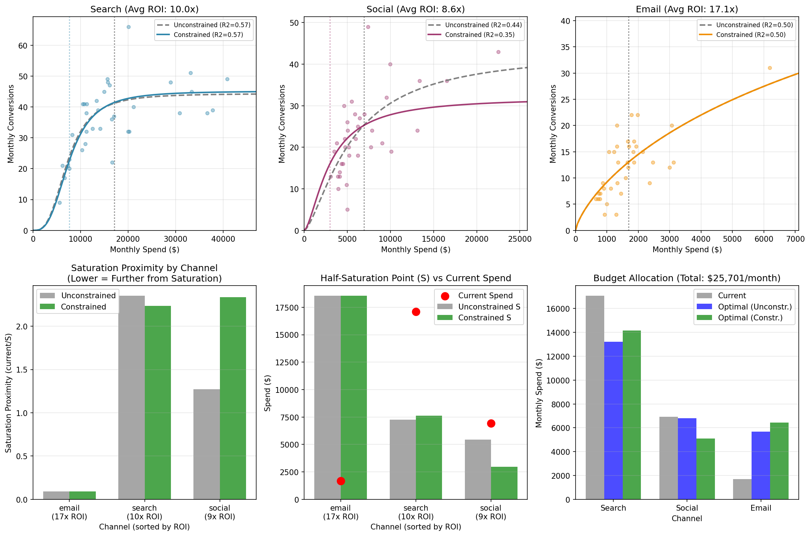

---
---
# Marketing Mix Model

[← Back to Home](../../index.md)

---

This page documents the Marketing Mix Model (MMM) that quantifies the relationship between marketing spend and customer conversions, enabling data-driven budget optimization.

---

## Model Overview

<table>
<tr>
<td width="55%" valign="top" markdown="1">

The model uses a **two-stage approach**:

1. **Response Curve**: Spend → Conversions (fit with Hill function)
2. **Profit Calculation**: Conversions × Avg Profit per Conversion

This separation produces tighter fits because the spend→conversions relationship is more direct than spend→profit (which includes claim variance).

**Model Fit (R², monthly):**

| Channel | R² |
|---------|-----|
| Search | 0.57 |
| Social | 0.44 |
| Email | 0.50 |

</td>
<td width="45%" valign="top">

<a href="constrained_comparison.png">
  
</a>
<em>Click to enlarge</em>

</td>
</tr>
</table>

---

## The Hill Saturation Function

Marketing spend exhibits **diminishing returns**—each additional dollar produces less than the last—and eventually **saturates**—there's a ceiling on what a channel can deliver.

The Hill function captures both:

```
Conversions(Spend) = K × Spend^β / (S^β + Spend^β)
```

**Parameters:**
- **K** = Maximum conversions per month (saturation ceiling)
- **S** = Half-saturation point (spend at which conversions = K/2)
- **β** = Shape parameter (steepness of the curve)

<a href="MMM_homepage.png">
  
</a>

---

## Economic Assumptions

Profit is calculated as **NPV of policy cash flows**, not gross margin:

| Assumption | Value | Rationale |
|------------|-------|-----------|
| Expense ratio | 30% | Operating costs as % of premium |
| Discount rate | 10% | Time value of money |

```
Annual profit = Annual premium × (1 - 0.30) - Annual claims
NPV = Annual profit × Annuity factor(10%, tenure)
```

---

## ROI-Saturation Constraint

A key innovation: the model enforces that **higher-ROI channels are further from saturation**.

**Intuition:** If a channel has high average ROI, it's likely because we're operating on the steep part of the response curve (far from saturation). Low average ROI suggests we're already in diminishing returns.

**Constraint:**
```
If ROI_i > ROI_j, then (Spend_i / S_i) < (Spend_j / S_j)
```

This prevents the model from incorrectly concluding that high-ROI channels are "saturated" when we simply haven't tested higher spend levels.

In this dataset the constraint is largely **confirmatory**: because spend varies widely enough to identify the curves, the unconstrained fit already orders the channels consistently with their ROI (email least saturated, search/social most). The constraint barely moves the result—so it functions as a robustness check rather than doing the heavy lifting, which is exactly what you want.

---

## Fitted Parameters

| Channel | K (Max Conv/mo) | S (Half-Sat) | β | % of Saturation | Avg Profit/Conv |
|---------|-----------------|--------------|---|-----------------|-----------------|
| Email | 91 | $18,552 | 0.75 | **8%** (far) | $2,318 |
| Social | 32 | $2,967 | 1.56 | 70% (near) | $2,561 |
| Search | 45 | $7,637 | 3.00 | 69% (near) | $4,727 |

**Interpretation:**
- **Email** is at just 8% of saturation—significant room to scale, and it carries the highest ROI
- **Search** and **Social** are both near 70% of saturation—approaching diminishing returns

---

## Optimal Budget Allocation

Given the fitted curves, the optimal allocation **equalizes marginal profit** across channels:

| Channel | Current | Optimal | Change |
|---------|---------|---------|--------|
| Search | $17,081/mo | $14,167/mo | **-$2,914** |
| Social | $6,934/mo | $5,089/mo | **-$1,845** |
| Email | $1,686/mo | $6,445/mo | **+$4,759** |

The optimization shifts ~$4,800/month out of search and social (both near saturation) into email (far from saturation, highest ROI).

---

## Model Limitations

1. **Extrapolated ceiling for under-saturated channels**: Email operates far below its half-saturation point, so its saturation ceiling is inferred from a limited set of high-spend observations rather than directly measured.

2. **No carryover effects**: Assumes spend in month N only affects conversions in month N. Brand effects and delayed conversions are ignored.

3. **No interaction effects**: Channels are modeled independently. In reality, search and social may reinforce each other.

4. **Monthly aggregation**: Fitting on monthly data stabilizes the curves (and damps weekly count noise) but leaves only 36 observations per channel, so parameter estimates carry meaningful uncertainty.

---

## Files

| File | Description |
|------|-------------|
| `MMM/marketing_mix_model.py` | Main model code |
| `MMM/constrained_comparison.png` | Response curves visualization |
| `MMM/MMM_homepage.png` | Summary chart for homepage |
| `MMM/constrained_results.json` | Fitted parameters |
| `MMM/constrained_report.txt` | Full text report |

---

[← Back to Home](../../index.md) | [Previous: EDA](../EDA/insurance_exploratory-analysis.md) | [Next: Optimization →](../Optimization/insurance_optimization.md)
