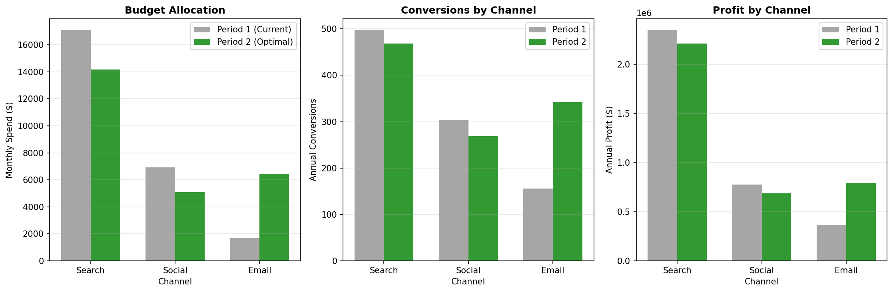
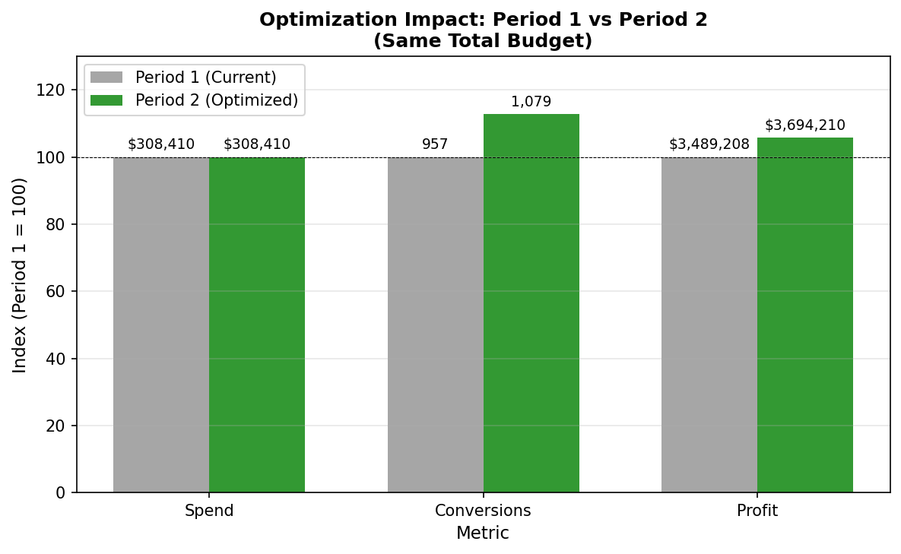

---
---

# Budget Optimization

[← Back to Home](../../index.md)

---

This page documents the budget optimization simulation that compares current allocation (Period 1) to optimal allocation (Period 2).

---

## Optimization Approach

<table>
<tr>
<td width="55%" valign="top" markdown="1">

Using the fitted response curves from the Marketing Mix Model, we simulate two scenarios at the monthly budget level:

**Period 1 (Current):** Historical budget allocation
- Search: $17,081/month
- Social: $6,934/month
- Email: $1,686/month
- **Total: $25,701/month**

**Period 2 (Optimal):** Budget reallocated to equalize marginal ROI
- Search: $14,167/month (-$2,914)
- Social: $5,089/month (-$1,845)
- Email: $6,445/month (+$4,759)
- **Total: $25,701/month** (same)

</td>
<td width="45%" valign="top">

<em>Click to enlarge</em>

</td>
</tr>
</table>

---

## Simulation Results

| Metric | Period 1 (Current) | Period 2 (Optimal) | Change |
|--------|-------------------|-------------------|--------|
| Marketing Spend | $308,410 | $308,410 | $0 |
| Conversions | 957 | 1,079 | **+122 (+12.8%)** |
| Profit | $3,489,208 | $3,694,210 | **+$205,002 (+5.9%)** |
| ROI | 11.3x | 12.0x | +0.7x |

---

## Why Does Reallocation Work?

The optimization works because **marginal ROI varies across channels**, depending on where each one sits on its response curve:

- **Email** ($1,686/mo) sits at just **8% of saturation**—on the steep part of its curve, so each additional dollar still buys strong incremental conversions (highest average ROI, 17.9x).
- **Search** ($17,081/mo) and **Social** ($6,934/mo) are both near **70% of saturation**—on the flattening part of their curves, so additional spend returns progressively less.

Moving dollars out of the near-saturated channels (search, social) into under-saturated email captures more conversions per dollar.

---

## Channel-Level Impact

### Email (Increased from $1,686 to $6,445/month)

| Metric | Period 1 | Period 2 | Change |
|--------|----------|----------|--------|
| Annual Spend | $20,238 | $77,342 | +$57,104 |
| Conversions | 156 | 342 | +186 |
| Profit | $361,863 | $793,154 | +$431,291 |
| ROI | 17.9x | 10.3x | -7.6x |

Email's ROI *decreases* as we spend more (diminishing returns), but it remains strongly profitable even at ~4x the spend—which is exactly why it absorbs most of the reallocated budget.

### Social (Decreased from $6,934 to $5,089/month)

| Metric | Period 1 | Period 2 | Change |
|--------|----------|----------|--------|
| Annual Spend | $83,205 | $61,070 | -$22,135 |
| Conversions | 303 | 268 | -35 |
| Profit | $776,990 | $687,400 | -$89,590 |
| ROI | 9.3x | 11.3x | +2.0x |

Social's ROI *increases* as we spend less (moving back up the curve), but we reallocate those dollars to a higher-opportunity channel.

### Search (Decreased from $17,081 to $14,167/month)

| Metric | Period 1 | Period 2 | Change |
|--------|----------|----------|--------|
| Annual Spend | $204,967 | $169,998 | -$34,969 |
| Conversions | 497 | 468 | -29 |
| Profit | $2,350,355 | $2,213,656 | -$136,699 |
| ROI | 11.5x | 13.0x | +1.5x |

Search is the most-saturated channel, so trimming its spend costs few conversions while its ROI improves—freeing budget for email.

---

## Optimization Theory

The optimal allocation satisfies the **equi-marginal principle**: 

> At optimum, the marginal profit per dollar is equal across all channels.

If marginal ROI were higher for one channel, we could improve total profit by shifting a dollar from a lower-marginal-ROI channel to it.

At the optimal allocation, the marginal profit from one more dollar is equalized across email, social, and search—no further reallocation can improve total profit.

---

## Caveats

1. **Model uncertainty**: The response curves are fit on 36 monthly observations and carry estimation error, especially email's saturation ceiling, which sits well above its observed spend.

2. **Extrapolation risk**: Email is currently at very low spend levels. The model extrapolates its performance at ~4x higher spend.

3. **Execution factors**: Can email volume actually scale 4x? Are there list fatigue effects?

4. **Competitive response**: Competitors may respond to our channel shifts.

**Recommendation:** Implement the reallocation gradually and monitor for saturation signals (declining conversion rates, rising CPL).

---

## Files

| File | Description |
|------|-------------|
| `Optimization/optimize_budget.py` | Simulation code |
| `Optimization/optimization_comparison.png` | Channel-level comparison |
| `Optimization/Optimization_homepage.png` | Summary chart |
| `Optimization/optimization_results.json` | Simulation results |

---

[← Back to Home](../../index.md) | [Previous: MMM](../MMM/insurance_marketing-mix-model.md) | [Next: Business Impact →](../../index.md#4-business-impact)
