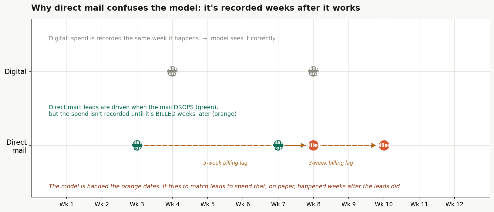
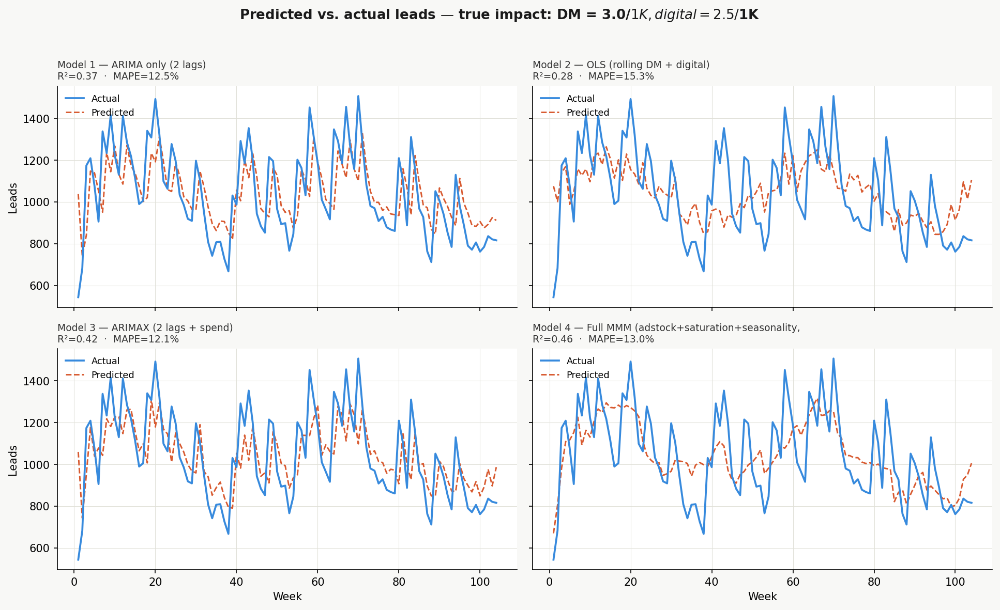
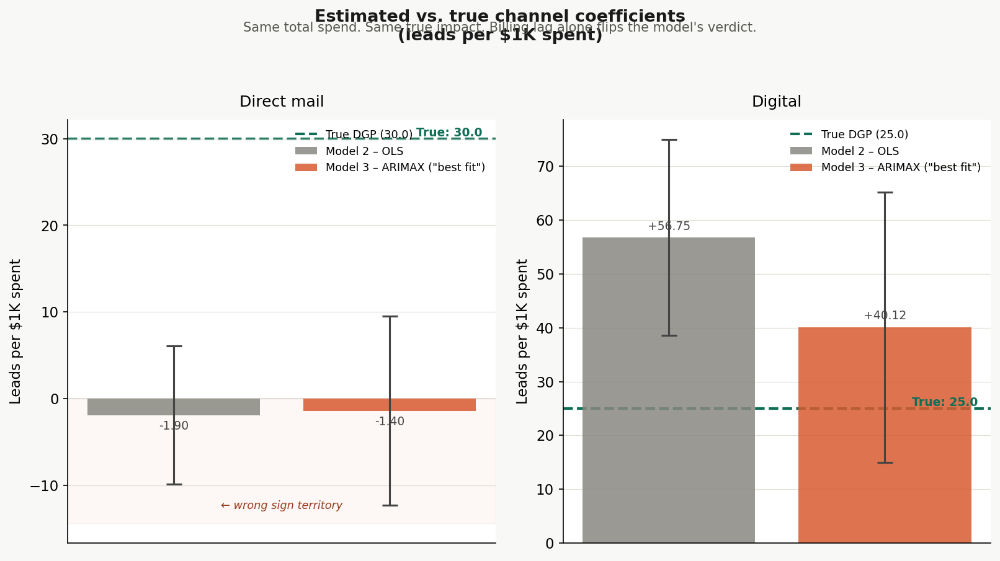
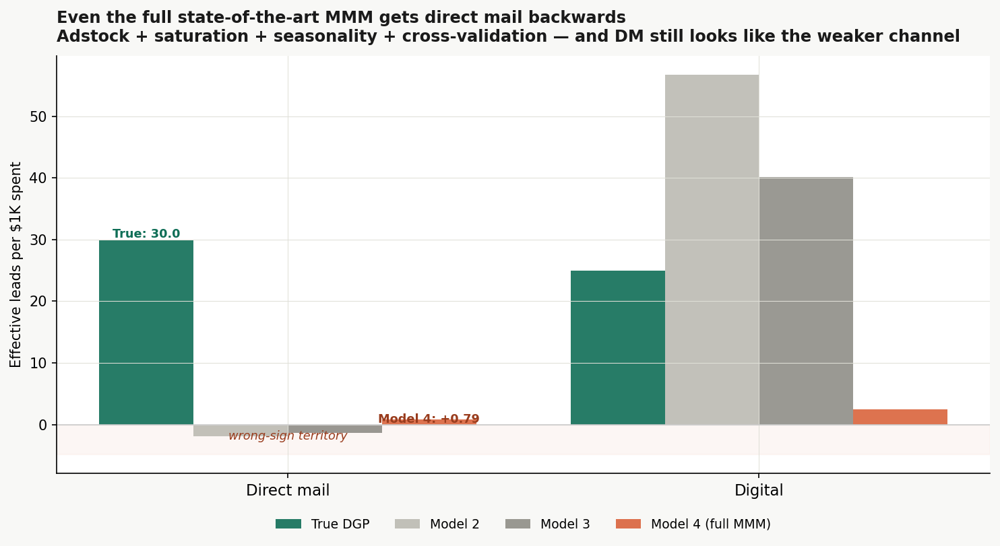
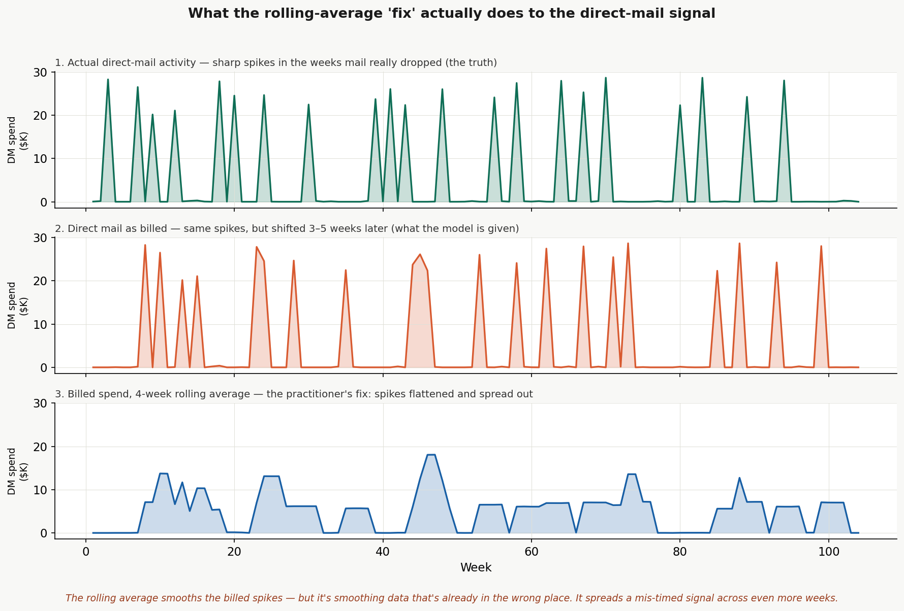

---
---
# When a Marketing Mix Model Fits Well and Still Points the Wrong Way

[← Back to Home](../index.md)

---

A small, self-contained simulation showing how a marketing mix model (MMM) can have a strong overall fit — high R², low MAPE, the works — while getting the one thing that matters for budgeting completely backwards: the *incremental* effect of moving spend between channels.

The point is not that MMMs are bad. The point is that **overall fit is the wrong success criterion.** What matters is whether the model correctly predicts the lift you get when spend actually changes. This project builds a world where the truth is known, then shows that a sequence of increasingly sophisticated models — up to and including a full Robyn-style MMM with adstock, saturation, seasonality, and cross-validation — all recommend cutting the better channel.

> **Note on the data:** The dataset is simulated from a known data-generating process, seeded for exact reproducibility. Working from a known ground truth is the whole method here — it's the only way to check whether the model recovers the truth or just *fits* the data.

**[View Repository →](https://github.com/mcbelli/mmm-good-fit-wrong-direction)**

---

## The Setup

The data is 104 weeks of simulated weekly leads driven by two channels, with a known data-generating process:

```
leads(t) = 400
         + 30 * adstock(direct_mail_actual)(t)   # DM is the STRONGER channel
         + 25 * digital_spend(t)
         + 0.35 * leads(t-1)                       # organic carry-over
         + noise
```

<table>
<tr>
<td width="55%" valign="top" markdown="1">

Two facts about the channels are the whole story:

- **Direct mail is the stronger channel** — 30 leads per \$1K versus 25 for digital. Total spend is held roughly equal across the two (~\$520K each over two years), so any difference the models find is about **timing and observability, not budget size**.
- **Direct mail is recorded when it is billed, not when it works.** A mail drop generates leads in the weeks around the drop, but the spend lands in the data 3–5 weeks later, when the invoice is paid. Digital is recorded the same week it runs. The analyst only ever sees the *billed* DM series.

</td>
<td width="45%" valign="top">

<a href="mmm_timing.png">
  
</a>
<em>The direct-mail billing lag: spend is recorded weeks after the leads it caused. Click to enlarge.</em>

</td>
</tr>
</table>

Direct mail also has a genuine behavioral response lag (adstock): a drop's effect is spread over the following few weeks, not concentrated in one. This matters because it is the thing a rolling-average "fix" can legitimately address — and it lets the project separate two different timing problems (see below).

---

## The Four Models

All read the same CSV. None can see the true (drop-date) DM spend; they get the billed series.

| Model | What it is | In-sample R² | MAPE |
|-------|-----------|:------------:|:----:|
| 1 | ARIMA(2,0,0), leads only — momentum baseline, no spend | 0.37 | 12.5% |
| 2 | OLS on 4-week rolling-avg billed DM + digital | 0.28 | 15.3% |
| 3 | ARIMAX(2,0,0): AR(2) + rolling DM + digital | 0.42 | 12.1% |
| 4 | Full MMM: adstock + Hill saturation + Fourier seasonality + ridge, decay tuned by 5-fold CV | **0.46** | 13.0% |

Model 4 is deliberately the strongest, most defensible model in the lineup — the one a skeptic can't dismiss with "but you didn't even do X." It has the best fit of the four. It is also the one whose budget advice is most confidently wrong.

<a href="mmm_fit_comparison.png">
  
</a>
<em>Predicted vs. actual leads across the four models. Click to enlarge.</em>

---

## What the Models Recover

True impact is DM = 30 leads/\$1K, digital = 25. The models, reading billed DM, recover something very different:

| | Direct mail | Digital |
|---|:---:|:---:|
| **True** | **30** | **25** |
| Model 2 | −1.9 | 56.8 |
| Model 3 | −1.4 | 40.1 |
| Model 4 (effective) | ~0.8 | ~2.4 |

Every model puts direct mail **at or below zero** and distorts the channels in ways that make DM look like the weaker bet. The billing shift moves the DM signal away from the leads it caused, the AR and adstock terms absorb what structure remains, and digital — cleanly timed — gets credited for the rest.

<a href="mmm_coefficients.png">
  
</a>
<em>True vs. estimated coefficients with 95% confidence intervals. Click to enlarge.</em>

---

## The Consequence: a Grounded Budget Shift

`shift_analysis.py` makes the cost concrete for a single 10-week window (weeks 51–60), moving \$20K out of direct mail and into digital (~\$2K/week against a ~\$5K/week baseline in each channel). Total budget is unchanged.

| Leads over the 10-week window | Value | vs. actual |
|---|:---:|:---:|
| Actual, no shift (reality) | 10,755 | — |
| **Model predicts** the shift yields | ~12,200 | **+1,450** |
| **True outcome** of the shift (DGP) | 10,682 | **−73** |

The model promises a large gain from a move that, in truth, slightly *reduces* leads. It gets the **direction** wrong and is wildly overconfident about the **size**. Because the two channels are genuinely close in value (30 vs 25), the real cost is small — the headline isn't "catastrophe," it's "the model can't even tell you the sign, and sells the move as a big win."

<a href="mmm_model4_impact.png">
  
</a>
<em>Model 4's predicted impact of the budget shift versus the true outcome. Click to enlarge.</em>

---

## Two Timing Problems, and Why a Rolling Average Can't Save You

<table>
<tr>
<td width="55%" valign="top" markdown="1">

A practitioner who suspects a DM timing issue will often reach for a rolling average of DM spend. The simulation shows why that is not enough, by separating two distinct effects:

- **Spread** — DM's true effect is distributed over several weeks (adstock). A rolling average *can* address spread: smoothing the regressor to match a smeared response is reasonable.
- **Shift** — billing delay *translates* the recorded spend later in time. A rolling average cannot undo a shift; averaging a mis-placed signal just blurs it across even more weeks, moving it no closer to where the leads occurred.

The fix for the problem shown here lives in the **data** — getting true mail-drop dates — not in the model.

</td>
<td width="45%" valign="top">

<a href="mmm_smearing.png">
  
</a>
<em>A 4-week rolling average flattens the billed spikes without relocating them. Click to enlarge.</em>

</td>
</tr>
</table>

---

## A Note on Cross-Validation

Model 4 tunes its adstock decay by 5-fold cross-validation. The CV quietly waves a red flag: it pushes the decay to the top of the grid and lands at a mean CV R² of roughly **zero** — i.e. the spend variables don't generalize out of sample. CV reduces *variance*; it cannot fix *bias*, and the billing shift is pure bias, identical across every fold. A careful analyst would notice the near-zero CV R². Many would ship the model anyway because the in-sample fit looks great.

---

## Technical Implementation

**Data generation** (`generate_data.py`): builds the data-generating process and writes `mmm_data.csv`, including hidden ground-truth columns (true DM spend, adstock, billing lag) that a real analyst would not have. Seeded with `np.random.default_rng(42)`, so every figure and number reproduces exactly.

**Estimation** (`estimate_and_plot.py`): fits Models 1–4 and produces the fit-comparison and Model-4 impact figures.

**Diagnostics** (`plot_coefficients.py`, `plot_explainer.py`): the true-vs-estimated coefficient chart and the non-technical billing-timing and rolling-average smearing explainers.

**Consequence** (`shift_analysis.py`): the grounded \$20K / 10-week budget-shift analysis with before/after spend and predicted-vs-true leads.

---

## Honest Limits

- This is a constructed illustration, not a claim about any specific real MMM. The DGP is deliberately simple (one true response lag, linear-in-adstock channel effects, seasonality flowing only through digital).
- The true channel values are close (30 vs 25), so the realized cost of a wrong budget move is modest. Widening that gap makes the dollar consequence larger without changing the mechanism.
- The fix lives in the **data** — correctly timed inputs — not in more modeling. No amount of adstock, saturation, seasonality, or cross-validation substitutes for getting the mail-drop dates right.

---

[← Back to Home](../index.md)
