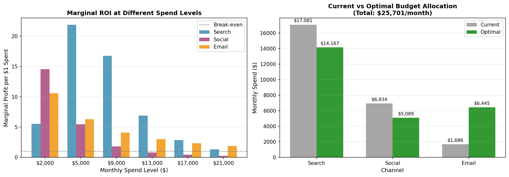
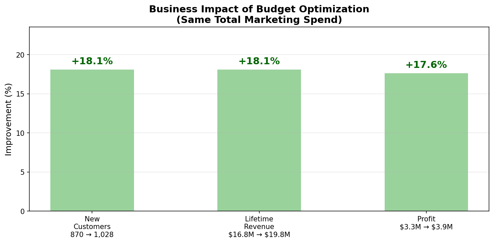

# Michael Belli

**Analytics Leader | 20+ Years Experience | Data-Driven Strategy**

[LinkedIn](https://www.linkedin.com/in/michaelbelli/) | [GitHub](https://github.com/mcbelli) | [Email](mailto:bellimike23@gmail.com)

---

## Insurance Marketing Analytics Decision Engine

This is a self-directed demonstration project. It walks an end-to-end analytics workflow for a B2C insurance company — from exploratory analysis through predictive modeling to budget optimization and business-impact measurement — to show *how I approach the work*.

> **Note on the data:** Everything here runs on a synthetic dataset I generated to mirror realistic insurance-marketing dynamics. The figures throughout are outputs of that simulation, included to illustrate the methodology end to end — not results from a client engagement.

**[View Repository →](https://github.com/mcbelli/insurance-marketing-analytics-decision-engine)**

---

## The Business Problem

In insurance, growth without risk discipline destroys value. Marketing teams optimize for lead volume and cost-per-lead, but cheap leads often become unprofitable policies. This project works through three questions:

1. Which marketing channels drive *profitable* growth—not just volume?
2. How do we model the diminishing returns of marketing spend?
3. Where should we reallocate budget to maximize lifetime value?

---

## 1. Exploratory Data Analysis

<table>
<tr>
<td width="55%" valign="top" markdown="1">

Eight exploratory analyses reveal the key dynamics of insurance marketing:

- **Credit score** strongly predicts both conversion and claims risk
- **Channel quality varies**: cheaper leads have higher loss ratios
- **Cross-sell customers** have 2x higher lifetime value
- **Geographic variation** requires state-level pricing adjustments

The EDA surfaces the core insight: **email has the highest ROI despite the lowest lead quality**, because its acquisition cost ($8/lead) is dramatically lower than paid search ($45/lead).

**[View Full EDA →](Insurance/EDA/insurance_exploratory-analysis)**

</td>
<td width="45%" valign="top">

<em>Click for details</em>

</td>
</tr>
</table>

---

## 2. Marketing Mix Model

<table>
<tr>
<td width="55%" valign="top" markdown="1">

The Marketing Mix Model (MMM) quantifies the relationship between spend and conversions using **Hill saturation curves**:

- **Response curves** capture diminishing returns at higher spend levels
- **Unit economics** (avg profit per conversion) vary by channel
- **ROI-saturation constraint** ensures high-ROI channels aren't mistakenly labeled as "saturated"

The model reveals that email is operating at just 8% of its half-saturation point—significant room to scale—while search is at 79%.

**[View Full Model Documentation →](Insurance/MMM/insurance_marketing-mix-model)**

</td>
<td width="45%" valign="top">

<em>Click for details</em>

</td>
</tr>
</table>

---

## 3. Budget Optimization

<table>
<tr>
<td width="55%" valign="top" markdown="1">

Using the fitted response curves, we simulate two scenarios:

- **Period 1 (Current)**: Historical budget allocation
- **Period 2 (Optimal)**: Budget reallocated to equalize marginal ROI across channels

With the **same total marketing spend**, the optimal allocation shifts ~$600/week from social to email, yielding:

- **+25% more conversions**
- **+6% higher profit**
- **20% lower customer acquisition cost**

**[View Optimization Details →](Insurance/Optimization/insurance_optimization)**

</td>
<td width="45%" valign="top">

<em>Click to enlarge</em>

</td>
</tr>
</table>

---

## 4. Business Impact

**Within the simulation**, reallocating the same modeled $227K annual marketing budget produces:

| Metric | Before | After | Change |
|--------|--------|-------|--------|
| New Customers | 746 | 931 | **+24.8%** |
| Lifetime Revenue | $14.4M | $17.9M | **+$3.6M** |
| Policy Profit | $1.7M | $1.8M | **+$102K** |
| CAC | $304 | $244 | **-20%** |

*(Profit rises far less than conversions because the reallocation leans into email — high ROI on acquisition cost, but lower-margin policies. Surfacing that trade-off is exactly the point of the model.)*

---

## Technical Implementation

**Data Generation:** Python script creating synthetic but realistic insurance marketing data with:
- 3 years of lead data across 3 products (Health, Life, Property/Casualty)
- 3 marketing channels with quality/cost trade-offs
- Full sales funnel with claims simulation

**Modeling:** Hill saturation functions with ROI-based constraints, fit using nonlinear least squares.

**Optimization:** Profit-maximizing budget allocation using scipy.optimize.

---

## About Me

I'm an analytics leader with 20+ years of experience developing data-driven strategies to optimize business performance. My work spans predictive modeling, marketing analytics, customer segmentation, and executive decision support.

**Core Skills:**
- Marketing & Customer Analytics
- Predictive Modeling
- Business Strategy
- Data Visualization
- Team Leadership

---

## Let's Connect

I'm open to analytics leadership roles and consulting engagements.

- **Consulting & services:** [mikebelli.com](https://www.mikebelli.com)
- **LinkedIn:** [linkedin.com/in/michaelbelli](https://www.linkedin.com/in/michaelbelli/)
- **GitHub:** [github.com/mcbelli](https://github.com/mcbelli)
- **Email:** [bellimike23@gmail.com](mailto:bellimike23@gmail.com)
